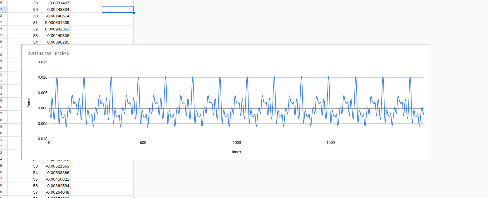
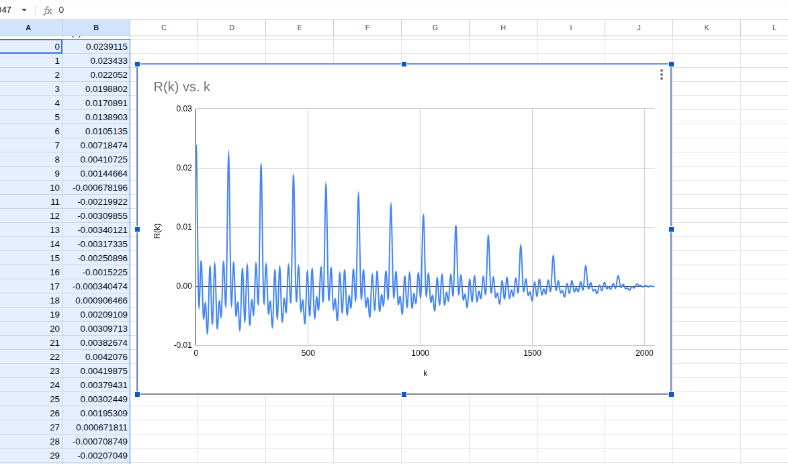
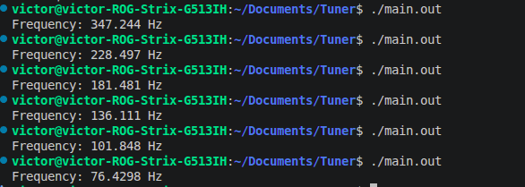
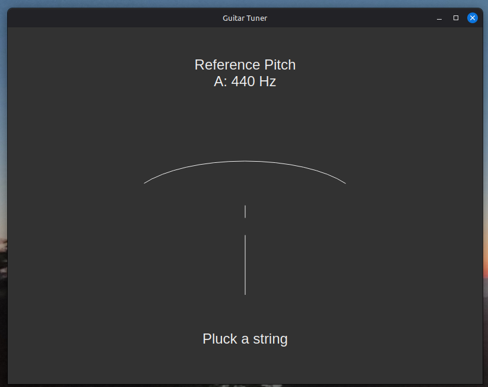
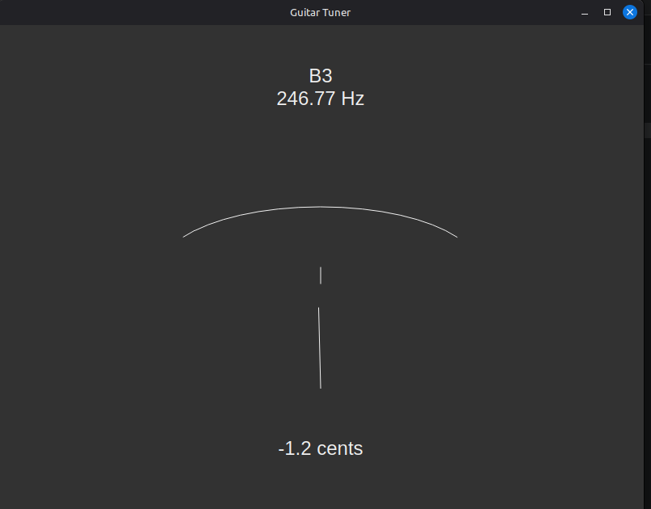

# Guitar Tuner App
- This project has been made for self use and coded with the help of AI, however I tried my best to do the stuff that I can do on my own and to understand and learn what the AI coded.

## How this app works and What it does
- This app reads the guitar signal from the amp connected through _USB_ to the laptop with the help of __ALSA library__ and determines the pitch of the signal. After that it compares it to what the pitch is supposed to be using the __equal temperament formula__. And all is shown in the _GUI_ built with __Qt__.

## A more in depth look at how it works. Step by step

### AudioHandler 
- The audio handler class has one main job - to read the audio signal, but before that it needs to open the device and to be configured. I tried to set the parameters to basically do this linux command in the code:
```bash
arecord -D hw:3,0 -f FLOAT_LE -c 4
```
- Reading the input - it's done in chucks and out of the 4 channels, I found that the guitar signal is just in one of the 4 channels.

### Signal Processor 
- The signal processor class's main objective is to clean the signal before detecting the frequency of the signal. 
- The signal is "cleaned" through a few different algorithms:
1. Removing DC
2. Root Mean Square - this is used to detect if the signal or the noise is quiet
3. Hann Window

- After that the frequency is calculated through __autocorrelation__.

- __Autocorreltion:__ helps identify reapiting patterns.

- Raw signal:


- Autocorrelation graph:


- Calculated frequencies: 


### Tuner 
- This class basically does the music theory part of the code. It takes th frequency calculated from the __Signal Processor__ and finds between what notes the frequency is, using _binary search_. The frequency notes are calculated beforehand using the _equal temperament sistem_ and stored into a _vector_. Also this class has a function to calculate the cents.

### GUI
- The gui was made in __Qt__ and this part was the part I least understood and was almost entirely _vibe coded_. This is my first time working with the Qt library and in the future I plan to revisit this project's GUI part after I become more familiar with this library.

- Hand drawn Icon:


- In app screenshot:



### TODO and Bugs
- Revisit GUI;
- Improve frequency detection system. YIN Algorithm;
- Fix bug where the app doesn't open at all when the amp is not plugged in the laptop through USB.
- Fix audio error bug where the app stops working if it's silence. Apparently this bug disappears when the laptop is connected to the power suply.